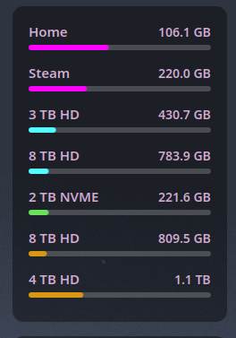

# Disk Space

A KDE Plasma panel widget that displays disk space usage for one or more mount points, with fully customisable colours.

 


## Features

- Visual usage bars per drive/partition
- Configurable mount points
- Custom bar and text colours
- Shows used / total in human-readable units (GiB / TiB)

## Requirements

- KDE Plasma 6.0+

## Installation

```bash
cd ~/.local/share/plasma/plasmoids/
git clone https://github.com/PlasmaDrifter/diskspace local.widget.diskspace
```

Then right-click your panel → **Add Widgets** → search for **Disk Space**.

## Configuration

Right-click the widget → **Configure…**

| Option | Description |
|--------|-------------|
| Mount points | Comma-separated list of paths to monitor (e.g. `/`, `/home`) |
| Bar colour | Fill colour for the usage bar |
| Text colour | Colour of the label text |

